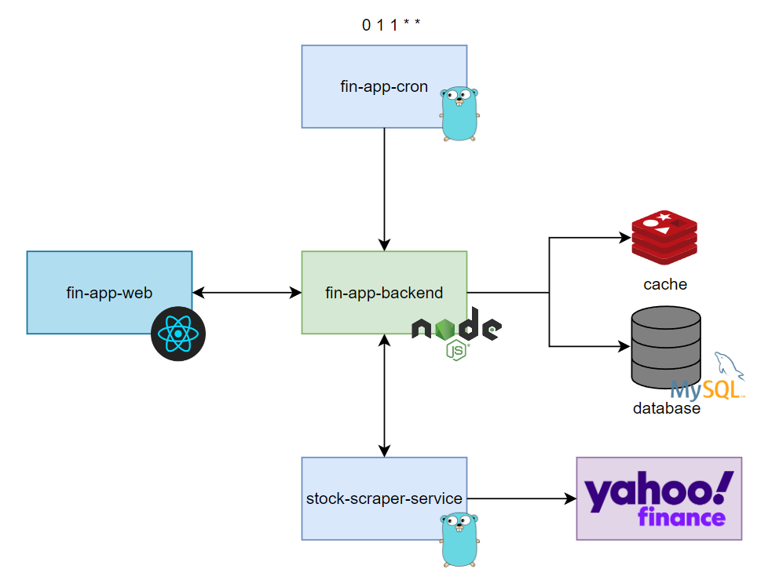

# Financial App

Personal financial app to manage:

- Monthly recurrent expenses
- Accounts
- Investments **(In development)**
- Transactions **(In development)**

## Technologies

### Programming Languages

- Node.js
- TypeScript
- Go

### Frameworks and Tools

- React
- TailwindCSS
- Zustand
- Prisma
- Go Colly
- MySQL
- Redis

### Platforms

- Vercel
- Planet Scale
- upstash

## Architecture

## Demonstration

## Author

Bruno Uemura
